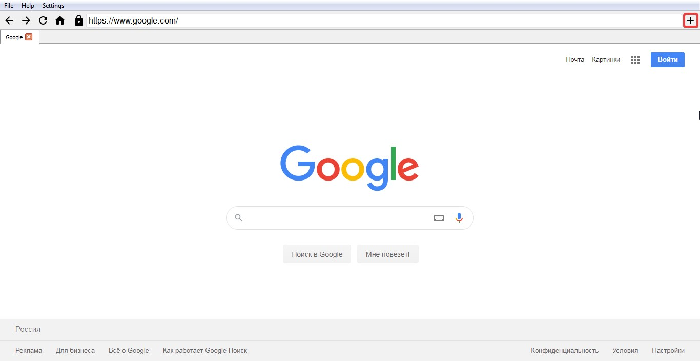

# Sibenshtern's Browser

Проект для Яндекс.Лицея. Простой браузер, который может собирать статистику по посещенный сайтам. 

#### Управление

1. **Панель вкладок:**

    - Два раза кликнуть по панели вкладок (не по вкладкам, а именно по панели)

    - С помощью кнопки на навигационной панели

        

2. **Статистика:**
    - Статистику можно посмотреть во вкладке Settings, также там можно выбрать, собирать статистику или нет и очистить её.

